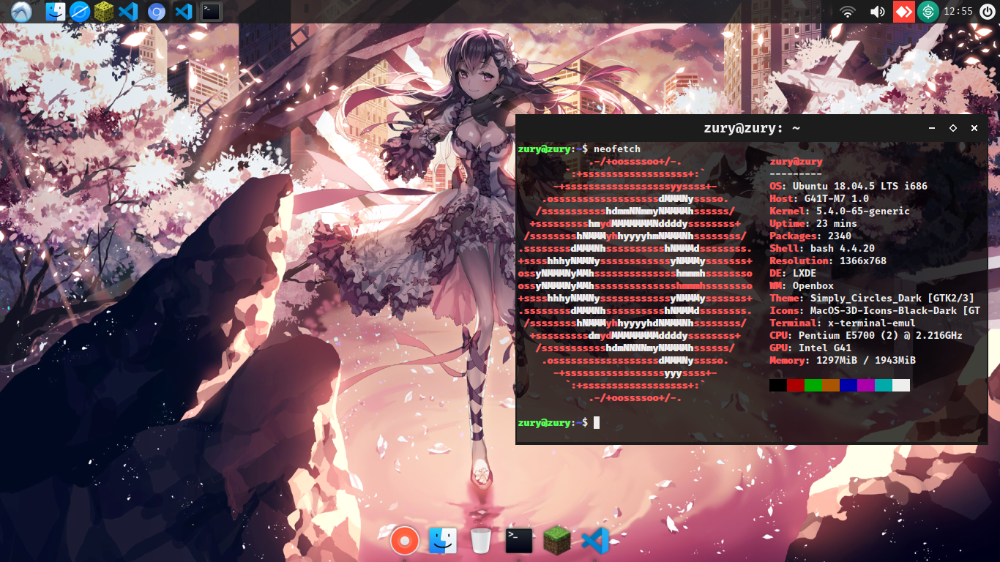

<h1 align="center">⚙️ My Lubuntu 18.04 LTS settings</h1>

<center>
    
</center>

<div styele="text-align:center;">
    <p style="font-size: 16px;">
        This repository put my program settings that I use in my day on my Lubuntu18.04 LTS. You can download and change them as much as you like, I recommend seeing several online forums,videos and repositories here on github.
    </p>
    <hr>
    <ul style="font-size: 16px;">
    Sites for wallpapers:
        <ul>
            <li>https://wall.alphacoders.com/</li>
            <li>https://wallpaperaccess.com/indie</li>
        </ul>
    Site for themes and icons:
        <ul>
            <li>https://www.gnome-look.org/</li>
        </ul>
    Site for programs:
        <ul>
            <li>Visual Studio Code: </li>
        </ul>
    </ul>
</div>


```
git clone git@github.com:VL0511/MyConfigLinux.git
or
git clone https://github.com/VL0511/MyConfigLinux.git
```

<p style="font-size:16px;">
    Custom folder will have all wallpapers, icons and themes that I have already downloaded, you can
    choose which one you want to look at themes, icons and wallpapers and use in the way that most pleases your operating system.
</p>

```
Install plank and xcompmgr
sudo apt install plank
and
sudo apt install xcompmgr
```
